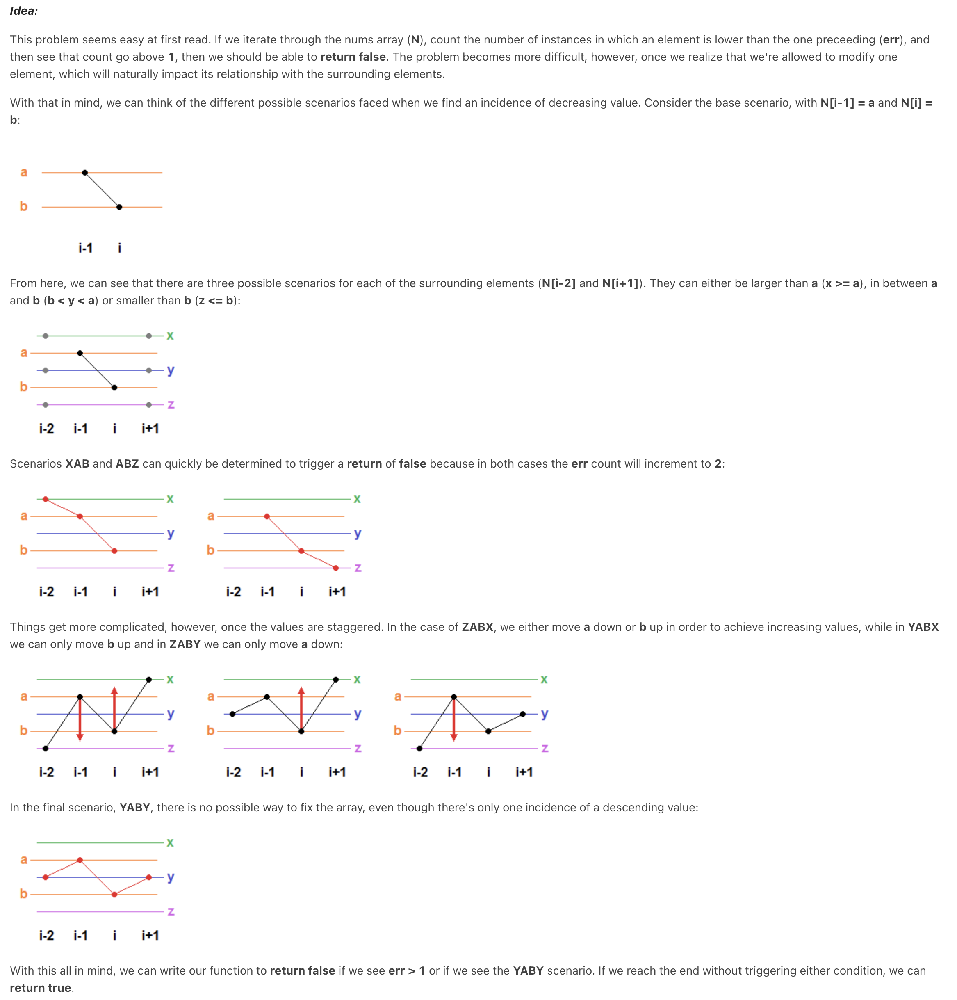

Topics:

Array.

```python
class Solution:
    def checkPossibility(self, nums: List[int]) -> bool:
        modified = False
        for i in reversed(range(1, len(nums))):
            # print(nums[i] , nums[i - 1])
            if nums[i] < nums[i - 1]:
                if not modified:
                    if i != len(nums) - 1 and nums[i + 1] < nums[i - 1]:
                        nums[i - 1] = nums[i]
                    modified = True
                else:
                    return False
        return True
```

把题目转化为递增数组的思路，避免了颠倒数组。

```python
class Solution:
    def checkPossibility(self, nums: List[int]) -> bool:
        modified = False
        for i in range(1, len(nums)):
            if nums[i] < nums[i - 1]:
                if not modified:
                    if i > 1 and nums[i] < nums[i - 2]:
                        nums[i] = nums[i - 1]
                    modified = True
                else:
                    return False
        return True
```

Ver 2.0，评论区大神给的思路，只允许修改一次值的情况下，只有 YABY 这种情况是直接丢出 `false`，其余情况可以通过修改一次值通过。这个算法可以在不进行任何值的修改的前提下，进行正确的判断。



```python
class Solution:
    def checkPossibility(self, nums: List[int]) -> bool:
        modified = False
        for i in range(1, len(nums)):
            if nums[i] < nums[i - 1]:
                # Return False if modified before, or if these conditions are satisfied.
                if modified or (
                    # Ensure `i - 2` and  `i + 1` exist,
                    i > 1
                    and i < len(nums) - 1
                    # if `i - 2` > `i`, it's a YAB of YABY,
                    and nums[i - 2] > nums[i]
                    # if `i - 1` > `i + 1`, it's a ABY of YABY.
                    and nums[i - 1] > nums[i + 1]
                ):
                    return False
                # If it's not the cases above, set modified to True,
                # no more chance for the next violation.
                modified = True
        return True
```
