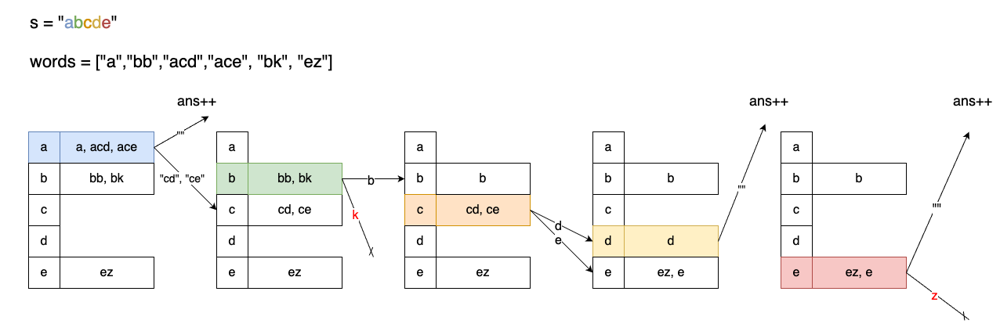

无脑思路...这道题定义的子序列不需要是连续的字符串，只需要字符按照原本的先后顺序排列即可，所以遗憾 `for in` 不能派上用场（废话）。

但这也难不倒无脑的我，定义在于先后顺序，那么我们每一次仅搜索从上一次找到的下标往后是不是存在下一个字符，如果找到下一个字符，这个下标保存继续循环，最后判断找到的字符数量是不是和愿字符串长度一致。

```python
class Solution:
    def numMatchingSubseq(self, s: str, words: List[str]) -> int:
        ans = 0
        for w in words:
            curr, cnt = 0, 0
            for c in w:
                try:
                    curr = curr + s[curr:].index(c) + 1
                    cnt += 1
                except:
                    break
            if cnt == len(w):
                ans +=1
        return ans
```

正常思路，桶。评论区的一个思路，作者命名为 “Next Letter Pointer” 方法。

我们将每个检查对象按照首字母放到对应的桶中，通过下面的方法实现仅遍历一次目标字符串就检查完所有目标的算法。

作者还做了一张图来可视化这个过程。算法思路如下。

- 准备好桶后，开始遍历目标字符串：
  - 用当前位置的字符取出对应的桶保留，就桶原本的位置重置为空桶；
  - 遍历取出的桶：
    - 如果字符长度为 1：说明找到了一个答案，计数器+1；
    - 否则：将字符串去头（第一个字符）后，按照首字母继续放入对应的桶中，等待后面有机会取出来；
  - 重复这个过程直到目标字符串遍历结束。



```python
class Solution:
    def numMatchingSubseq(self, s: str, words: List[str]) -> int:
        ans, bucket = 0, defaultdict(list)
        for w in words:
            bucket[w[0]].append(w)
        for c in s:
            target, bucket[c] = bucket[c], []
            for w in target:
                if len(w) == 1:
                    ans += 1
                    continue
                bucket[w[1]].append(w[1:])
        return ans
```

Java 版本，好长长长...

```java
class Solution {
    private class Node {
        public String w;
        public int p;
        public Node(String w, int p) {
            this.w = w;
            this.p = p;
        }
    }
    public int numMatchingSubseq(String s, String[] words) {
        List<Node>[] bucket = new ArrayList[26];
        int ans = 0;
        for (int i = 0; i < 26; i++) {
            bucket[i] = new ArrayList<Node>();
        }
        for (String word : words) {
            bucket[word.charAt(0) - 97].add(new Node(word, 0));
        }
        for (char c : s.toCharArray()) {
            List<Node> target = bucket[c - 97];
            bucket[c - 97] = new ArrayList<Node>();
            for (Node n : target) {
                if (n.p + 1 == n.w.length()) {
                    ans++;
                } else {
                    n.p ++;
                    bucket[n.w.charAt(n.p) - 97].add(n);
                }
            }
        }
        return ans;
    }
}
```
